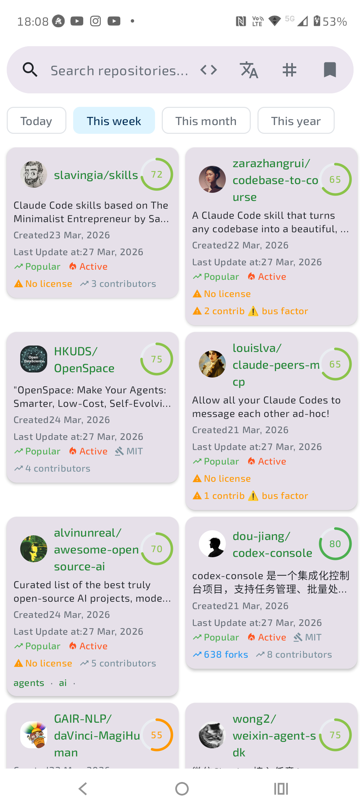
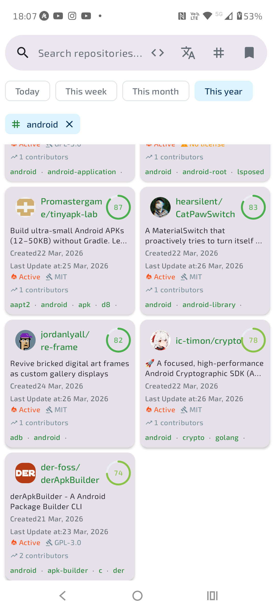
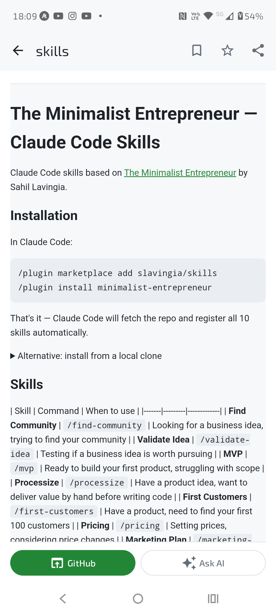
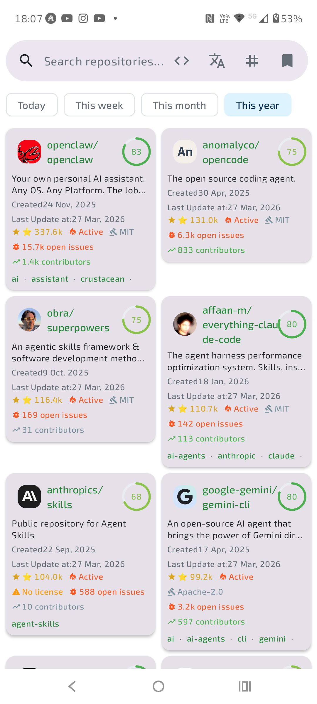

# GitHub Trending Explorer

Discover what's hot on GitHub — right from your phone. Browse trending repositories by time period, filter by topic, programming language, or spoken language, and dive into full repo details with rendered READMEs, commit sparklines, and dependency analysis.

No more doomscrolling Twitter for repo recommendations. This app surfaces the best open-source projects daily, weekly, monthly, and yearly — powered by a free self-updating cache that keeps everything fast and offline-friendly.

<p align="center">
  
  
</p>

## Features

**Trending Discovery**
- Browse trending repos across four time ranges: Today, This Week, This Month, This Year
- Pre-cached via GitHub Actions — loads instantly, no API quota burned
- 500+ repos cached daily across all periods and popular topics

**Smart Filtering**
- Filter by **topic** — pick from a curated list of popular GitHub topics (kotlin, android, python, rust, go, and more)
- Filter by **programming language** — 50+ languages supported
- Filter by **spoken language** — find repos with READMEs in your language
- Combine multiple filters — stack topics, languages, and time periods together
- All filters appear as dismissible chips for quick adjustment

**Rich Repo Cards**
- Star count with visual score ring, fork count, license info
- Activity status indicators (Active/Popular), open issues count
- Contributor count with sparkline commit history
- Clickable topic tags for instant discovery pivots
- Owner avatars loaded via Coil

**Deep Repo Details**
- Full README rendered as HTML with proper image resolution
- Commit activity sparkline (last 52 weeks)
- Dependency analysis — detects package.json, build.gradle, requirements.txt, Cargo.toml, go.mod, Gemfile, pubspec.yaml, pom.xml, Podfile, composer.json, Package.swift
- One-tap open in GitHub, share, star (with OAuth), or save to favorites
- **Ask AI** — generates a detailed analysis prompt and sends it to your preferred AI assistant

<p align="center">
  
  
</p>

**Search & Save**
- Full-text search across all of GitHub via GraphQL and REST APIs
- Save your favorite search configurations (query + filters) as named bookmarks
- Infinite scroll pagination with prefetching (page size 20)
- Pull-to-refresh on all lists

**GitHub Integration**
- Star/unstar repos directly from the app (OAuth login)
- Save repos to local favorites for offline access
- User profile viewer with follower/following/repo counts

## Architecture

Clean Architecture with MVVM + MVI pattern, built entirely with Jetpack Compose.

```
domain/    Pure Kotlin — models, repository interfaces, use cases
data/      GraphQL + REST clients, cached data source, paging, repository implementations
ui/        Compose screens, ViewModels (MVI intents/state/effects), Atomic Design components
di/        Hilt modules for dependency injection
```

All ViewModels depend on interfaces only — fully testable with fakes (no mocking frameworks). The app uses a delegating repository pattern that transparently switches between:

1. **Static JSON cache** (GitHub Pages) — for trending/topic queries, updated daily via GitHub Actions
2. **GraphQL API** (Apollo) — for live searches and repo details
3. **REST API** — as a fallback/alternative

## Setup

1. Generate a [GitHub Personal Access Token](https://github.com/settings/tokens) with `public_repo` scope
2. Add to `local.properties`:
   ```properties
   github.token=ghp_your_token_here
   ```
3. Build and run from Android Studio

The token is required for the GitHub GraphQL API. Cached trending data loads without authentication.

**Optional — OAuth (star/unstar repos):**
Register a [GitHub OAuth App](https://github.com/settings/developers) with callback URL `ghrepobrowser://oauth/callback`, then add to `local.properties`:
```properties
github.client.id=your_client_id
github.client.secret=your_client_secret
```

Requires Android 8.0+ (API 26). Targets SDK 36.

## Tech Stack

| Library | Purpose |
|---|---|
| Jetpack Compose + Material 3 | UI framework |
| Apollo GraphQL | GitHub GraphQL API client |
| Hilt | Dependency injection |
| Paging 3 | Infinite scroll pagination |
| Navigation Compose | Type-safe navigation with shared element transitions |
| Coil 3 | Image loading |
| Room | Local database for favorites |
| DataStore | Preferences and auth token storage |
| CommonMark | Markdown to HTML rendering |
| OkHttp | HTTP client with logging interceptors |
| Kotlinx Serialization | JSON parsing for REST and cache |
| Kotlinx Immutable Collections | Stable Compose state collections |
| Turbine | Flow testing |
| GitHub Actions + Pages | Daily-updating JSON cache + Play Store deployment |

## Deployment

The app deploys to Google Play via Fastlane, triggered by pushing a version tag (`v*`) or manually via `workflow_dispatch`:

- **Tracks:** internal, beta, production
- **Pipeline:** `.github/workflows/deploy-play-store.yml` — builds release AAB, signs, and uploads via Fastlane
- **Privacy Policy:** [rsavutiu.github.io/GithubPublicRepoBrowser/privacy-policy.html](https://rsavutiu.github.io/GithubPublicRepoBrowser/privacy-policy.html)
